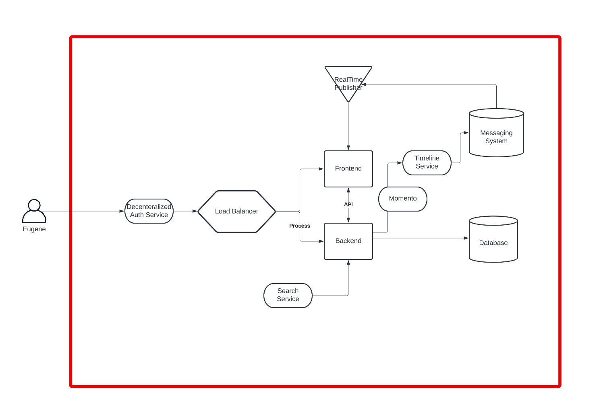
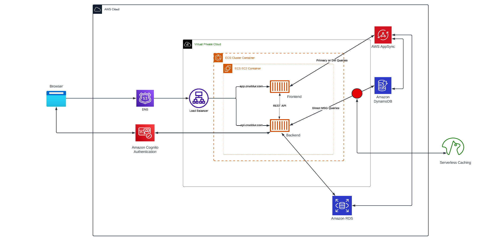
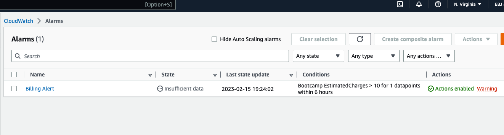
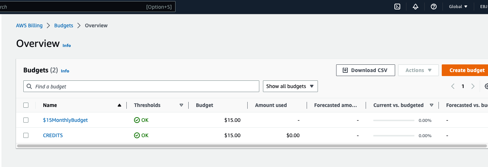

# Week 0 — Billing and Architecture

## Required Homework/Tasks

### Cruddur Conceptual Design

[Conceptual Design Link](https://lucid.app/lucidchart/invitations/accept/inv_9f4a16db-1622-454b-845b-2f62eccc089a)

### Cruddur Logical Design

[Logical Diagram Link](https://lucid.app/lucidchart/invitations/accept/inv_d96c3017-4417-4046-bf95-a2acf9110748)

## Create a Billing Alarm

## Create a Budget
I created two budgets as instructed.

